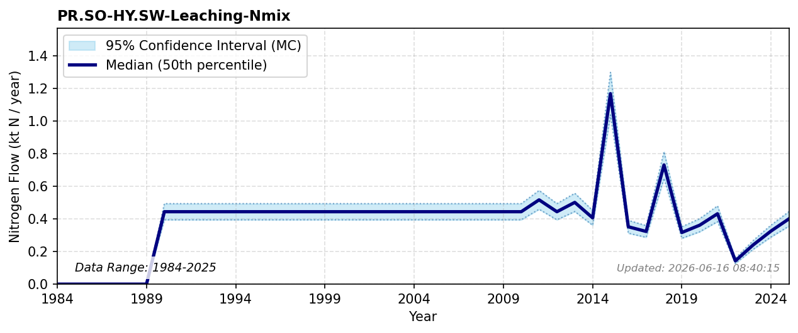

# Leaching from Landfills

### Flow Description
**{exact_flow_code}** Nmix is taken from Miljødirektoratet (2026), emissions to water from landfills, where we have categorized landfills as being connected to municipal wastewater or not based on publicly available data. Where the categorization was not possible, the resulting emissions have been split evenly between the leaching and wastewater flows from landfills. As no data are available before 2009 we have extrapolated using the average value. This probably underestimates the real value because landfilling was more prevalent in previous years.

### References

* Miljødirektoratet (2026). *Norske {Utslipp*. [norskeutslipp.no](norskeutslipp.no)
