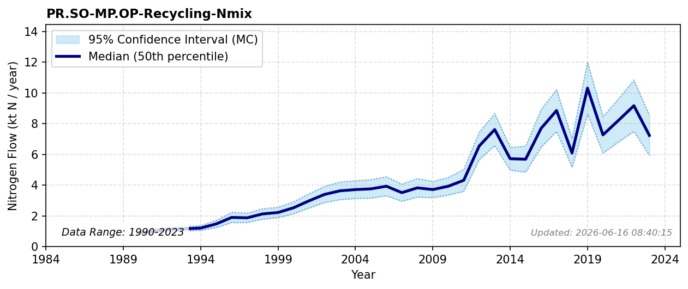

# Material Recycling

### Flow Description
**PR.SO-MP.OP-Recycling-Nmix** is found from SSB tables 05281 “Avfallsregnskap for Norge (1 000 tonn), etter statistikkvariabel, behandlingsmåte, materialtype og år “ (1995-2011) and 10513 “Avfallsregnskap for Norge (1 000 tonn), etter materialtype, statistikkvariabel, år og behandlingsmåte” (2012-2023). The international background of embedding nitrogen in commodity and trade loops is outlined in \({oita_substantial_2016)}. We have not included the categories sludge, garden waste and wet organic material reported as being assigned to material recycling, because this use is rather for soil production or fertilizer and does not belong in the MP.OP subpool.

### References

* Missing reference data for key: `{oita_substantial_2016`
