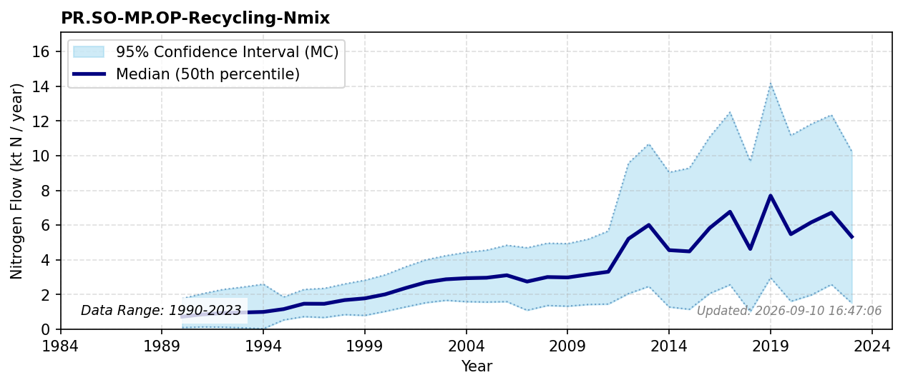

# Material Recycling

### Flow Description
**PR.SO-MP.OP-Recycling-Nmix** is found from SSB tables 05281 “Avfallsregnskap for Norge (1 000 tonn), etter statistikkvariabel, behandlingsmåte, materialtype og år “ (1995-2011) and 10513 “Avfallsregnskap for Norge (1 000 tonn), etter materialtype, statistikkvariabel, år og behandlingsmåte” (2012-2023), using N content values from Schäppi et al. (2025). We have not included the categories sludge, garden waste and wet organic material reported as being assigned to material recycling, because this use is rather for solid production or fertilizer and does not belong in the MP.OP subpool. Table 10513 introduces a new, large "mixed waste" (blandet avfall) reporting category from 2012 with no equivalent in the earlier table 05281, which shows up as a jump in this flow from about 3.5 kt N in 2011 to about 5.6 kt N in 2012.

### References

* Schäppi, B., Reutimann, J., Bogler, S., & Ehrler, A. (2025). *Detailed Annexes to ECE/EB.AIR/119 – “Guidance document on national nitrogen budgets*. [https://www.clrtap-tfrn.org/sites/default/files/2025-05/Annexes%20to%20the%20Guidance%20Document%20on%20NNB.pdf](https://www.clrtap-tfrn.org/sites/default/files/2025-05/Annexes%20to%20the%20Guidance%20Document%20on%20NNB.pdf)
