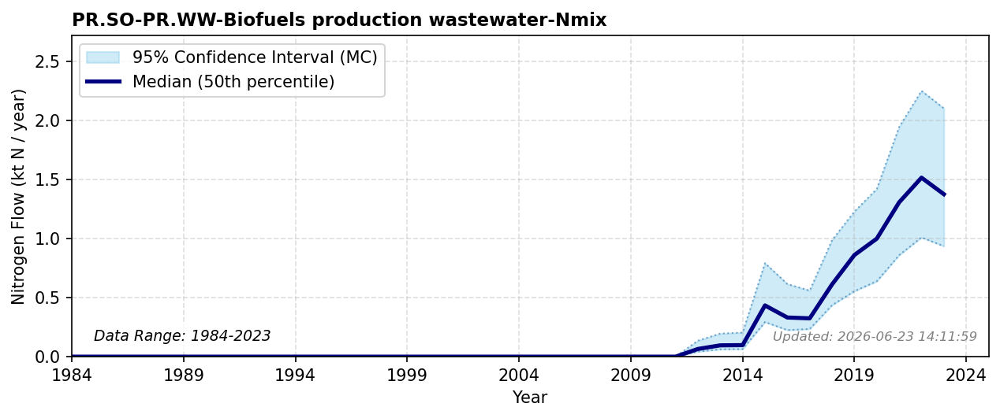

# Biofuels Production Wastewater

### Flow Description
**PR.SO-PR.WW-Biofuels production wastewater-Nmix** is found by assuming that the incoming N to biofuel production not retained in digestate ends up in the wastewater. Values before 2012 are set to zero. IN PROGRESS

