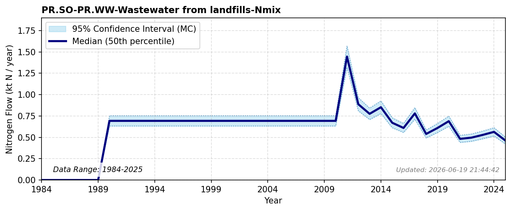

# Wastewater from Landfills

### Flow Description
**PR.SO-PR.WW-Wastewater from landfills-Nmix** is taken from landfill emissions data, where we have categorized landfills as being connected to municipal wastewater or not based on publicly available data. Regional limits for non-agricultural nitrogen loads into sewage systems are detailed in \\citep{{schulte_uebbing_planetary_2022}}. Where the categorization was not possible, the resulting emissions have been split evenly. As no data are available before 2009 we have extrapolated using the average value.

### References


