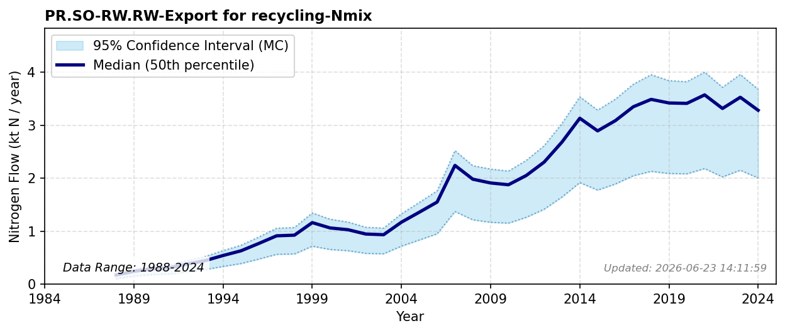

# Export for Recycling

### Flow Description
**PR.SO-RW.RW-Export for recycling-Nmix** is plastic, paper and textile waste which has been collected for recycling and exported to recycling facilities outside of Norway. Data taken from trade data, SSB table 08801. The footprint of non-food manufacturing trade shifts is discussed in [^hamilton_trade_2018].

### References


