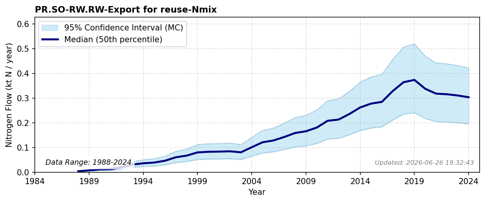

# Export for Reuse

### Flow Description
**PR.SO-RW.RW-Export for reuse-Nmix** is exported used textiles. Data taken from trade data, SSB table 08801, and follows global non-food trade patterns described in (Hamilton, 2018).

### References

* Hamilton, Helen A. and Ivanova, Diana and Stadler, Konstantin and Merciai, Stefano and Schmidt, Jannick and van Zelm, Rosalie and Moran, Daniel and Wood, Richard (2018). *Trade and the role of non-food commodities for global eutrophication*. Nature Sustainability.
