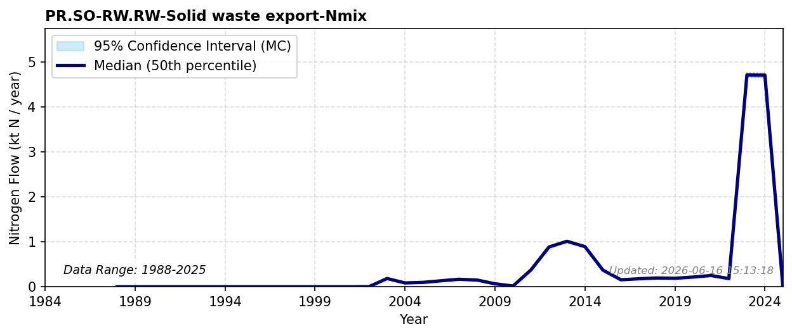

# Solid Waste Export

### Flow Description
**PR.SO-RW.RW-Solid waste export-Nmix** is taken from trade data, SSB table 08801. The impact of escalating international commodity trade on domestic vs. rest-of-world nitrogen footprints is quantified in (Malik, 2022) and (Lassaletta, 2016). No export in these categories is reported before 2002, so we set all previous years to zero.

### References

* Lassaletta, L., Billen, G., Garnier, J., Bouwman, L., Velazquez, E., Mueller, N. D., & Gerber, J. S. (2016). *Nitrogen use in the global food system: past trends and future trajectories of agronomic performance, pollution, trade, and dietary demand*. Environmental Research Letters. [https://doi.org/10/gj2grh](https://doi.org/10/gj2grh)
* Malik, A., Oita, A., Shaw, E., Li, M., Ninpanit, P., Nandel, V., Lan, J., & Lenzen, M. (2022). *Drivers of global nitrogen emissions*. Environmental Research Letters. [https://doi.org/10/gpf2kf](https://doi.org/10/gpf2kf)
