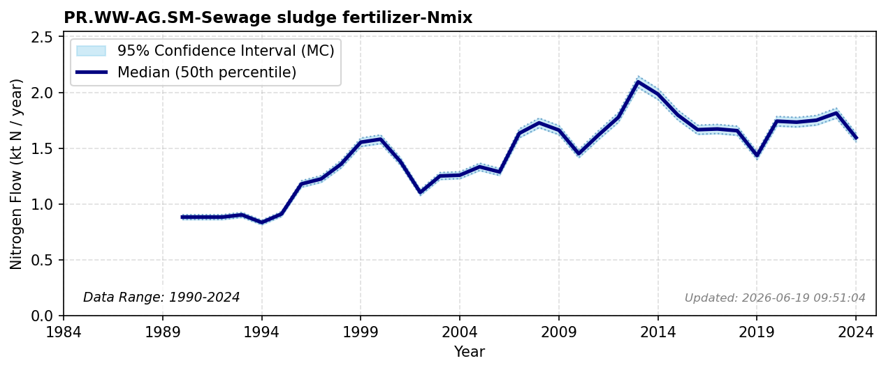

# Sewage Sludge Fertilizer to Ag

### Flow Description
**PR.WW-AG.SM-Sewage sludge fertilizer-Nmix** is taken from SSB table 05279 “Avløpsslam, etter slamdisponering, statistikkvariabel, år og region”. Mass balance studies of sewage sludge allocation to crops highlight a major opportunity to shift towards synthetic fertilizer substitution \\citep{starck_fate_2023}\\citep{kaltenegger_urban_2023}. For years 1993-2001 we use data from the SSB Naturressurser og miljø series.

### References

* Kaltenegger, Katrin and Bai, Zhaohai and Dragosits, Ulrike and Fan, Xiangwen and Greinert, Andrzej and Guéret, Samuel and Suchowska-Kisielewicz, Monika and Winiwarter, Wilfried and Zhang, Lin and Zhou, Feng (2023). *Urban nitrogen budgets: {Evaluating} and comparing the path of nitrogen through cities for improved management*. Science of The Total Environment.
* Starck, Thomas and Fardet, Tanguy and Esculier, Fabien (2023). *Fate of nitrogen in {French} human excreta: current waste and agronomic opportunities for the future*.
