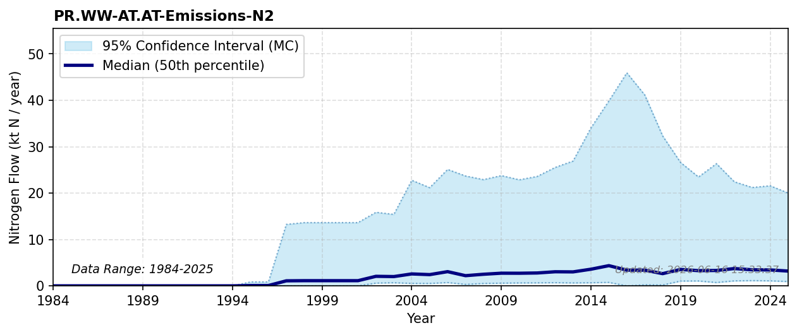

# N2 Emissions (Wastewater)

### Flow Description
**PR.WW-AT.AT-Emissions-N2** is found by using data on N emissions and removal rates from wastewater treatment plants equipped with nitrogen removal. The dynamics of losing significant shares of excreted nitrogen as inert N2 via WWTP denitrification are detailed in (Starck, 2023) and (Fowler, 2013). Where specific data were missing we assumed a default 70 % removal rate.

### References

* Fowler, D., Coyle, M., Skiba, U., Sutton, M. A., Cape, J. N., Reis, S., Sheppard, L. J., Jenkins, A., Grizzetti, B., Galloway, J. N., Vitousek, P., Leach, A., Bouwman, A. F., Butterbach-Bahl, K., Dentener, F., Stevenson, D., Amann, M., & Voss, M. (2013). *The global nitrogen cycle in the twenty-first century*. Philosophical Transactions of the Royal Society B: Biological Sciences. [https://doi.org/10.1098/rstb.2013.0164](https://doi.org/10.1098/rstb.2013.0164)
* Starck, T., Fardet, T., & Esculier, F. (2023). *Fate of nitrogen in {French} human excreta: current waste and agronomic opportunities for the future*. arXiv. [http://arxiv.org/abs/2310.06880](http://arxiv.org/abs/2310.06880)
