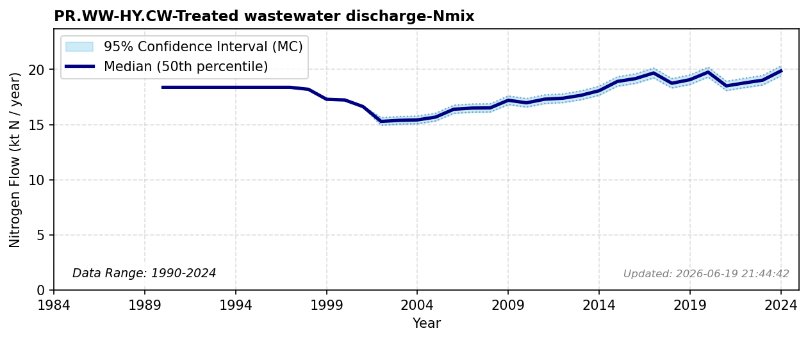

# Treated Wastewater Discharge to CW

### Flow Description
**PR.WW-HY.CW-Treated wastewater discharge-Nmix** is taken from SSB table 05280 “Totale utslipp av fosfor og nitrogen fra avløpssektoren”. The critical necessity of mitigating coastal aquatic eutrophication from wastewater discharges is documented in [^staalstrom_utredning_2022] and [^schulte-uebbing_planetary_2022]. Due to lack of available data we set the values in 1990-1996 to be equal to that in 1997.

### References


