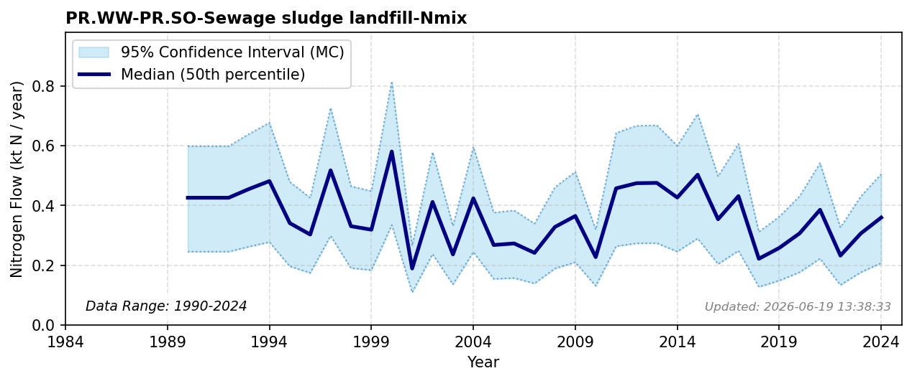

# Sewage Sludge to Landfill

### Flow Description
**PR.WW-PR.SO-Sewage sludge landfill-Nmix** is taken from SSB table 05279, including both sludge that is landfilled and sludge used for top cover on landfills. Global and historical trajectories of crop and livestock system nutrient allocations show a distinct contrast to such structural landfilling losses (Lassaletta, 2016). For years 1993-2001 we use data from the SSB Naturressurser og miljø series.

### References

* Lassaletta, Luis and Billen, Gilles and Garnier, Josette and Bouwman, Lex and Velazquez, Eduardo and Mueller, Nathaniel D. and Gerber, James S. (2016). *Nitrogen use in the global food system: past trends and future trajectories of agronomic performance, pollution, trade, and dietary demand*. Environmental Research Letters. [https://doi.org/10.1088/1748-9326/11/9/095007](https://doi.org/10.1088/1748-9326/11/9/095007)
