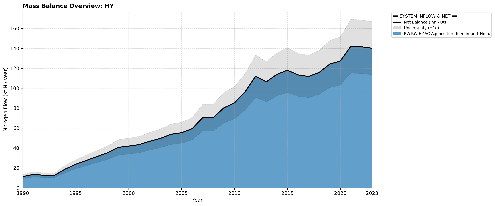

# Pool: Hydrosphere (HY)

We have chosen to not include the pool groundwater (GW) because N concentrations and dynamics in Norway are largely unknown (kvaerno_2024).

The hydrosphere ecosystem is split into three operational modules. Explore them below:

* [Surface Water (HY.SW)](subpool_surface_water.html)
* [Coastal Water (HY.CW)](subpool_coastal_water.html)
* [Aquaculture (HY.AC)](subpool_aquaculture.html)

---

## Mass Balance Overview (1990-2023)

The chart below illustrates the integrated nitrogen mass balance for **HY**. It includes total system inflows (positive stack), total outflows (negative stack), and the net balance line with estimated uncertainty bounds (±1σ).

### References

