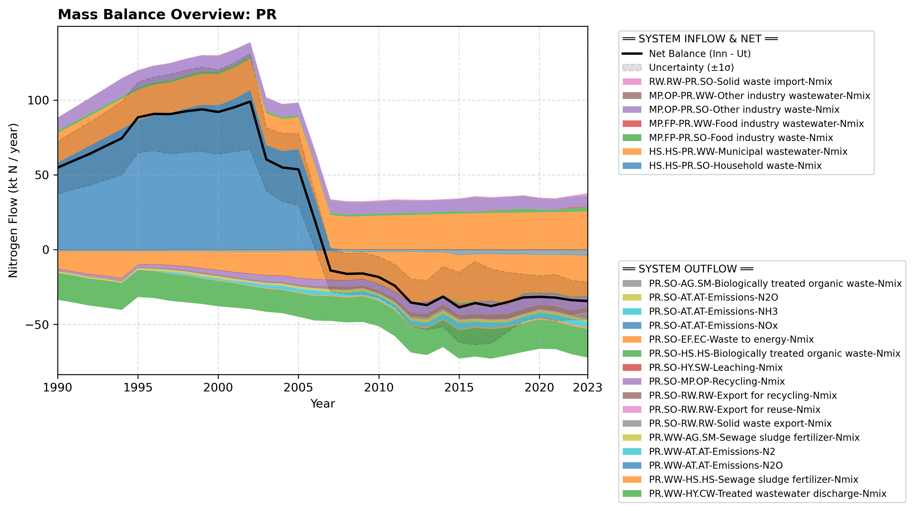

# Pool: Processing of residues (PR)

This pool accounts for the treatment and processing of waste and wastewater residues in Norway.

---

## Mass Balance Overview (1990-2023)

The chart below illustrates the integrated nitrogen mass balance for **PR**. It includes total system inflows (positive stack), total outflows (negative stack), and the net balance line with estimated uncertainty bounds (±1σ).

