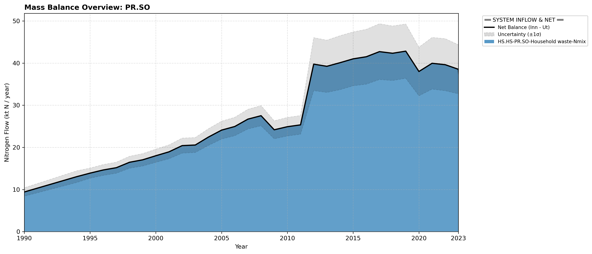

# Subpool: Solid Waste (PR.SO)

---

## Mass Balance Overview (1990-2023)

The chart below illustrates the integrated nitrogen mass balance for **PR.SO**. It includes total system inflows (positive stack), total outflows (negative stack), and the net balance line with estimated uncertainty bounds (±1σ).

### Flows that are zero or neglected:

* **PR.SO-AG.SM-Manure co-digestation-Nmix** is tracked under agricultural sub-allocations where applicable and excluded here to prevent double counting.

### References


