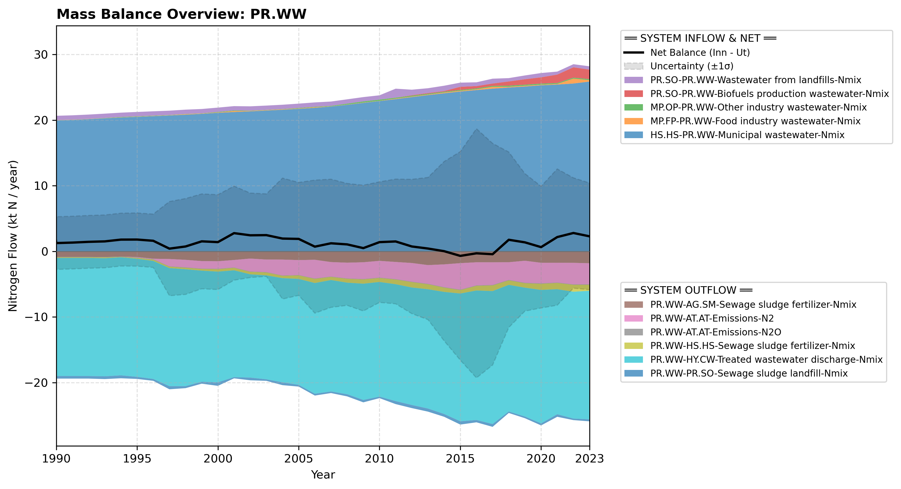

# Subpool: Wastewater (PR.WW)

---

## Mass Balance Overview (1990-2023)

The chart below illustrates the integrated nitrogen mass balance for **PR.WW**. It includes total system inflows (positive stack), total outflows (negative stack), and the net balance line with estimated uncertainty bounds (±1σ).

### Flows that are zero or neglected:

* Direct industrial untreated sewer overflows are consolidated into total treated flows or omitted where minor regional boundaries apply \\citep{schulte_uebbing_planetary_2022}.

### References

* Missing reference data for key: `schulte_uebbing_planetary_2022`
