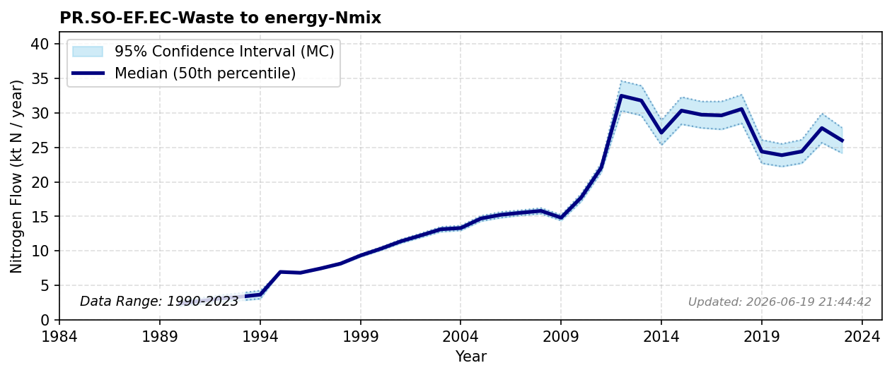

# Waste to energy (Incineration)

### Flow Description
**PR.SO-EF.EC-Waste to energy-Nmix** is found from SSB tables 05281 “Avfallsregnskap for Norge (1 000 tonn), etter statistikkvariabel, behandlingsmåte, materialtype og år “ (1995-2011) and 10513 “Avfallsregnskap for Norge (1 000 tonn), etter materialtype, statistikkvariabel, år og behandlingsmåte” (2012-2023), using N content values from Schäppi et al. (2025).
\nFor years prior to 1995, we use the overall fraction of waste to incineration given in historical records and assume that the overall N content of the waste is equal to the 1995 value. For years with missing data, we interpolate.

### References

* Schäppi, B., Reutimann, J., Bogler, S., & Ehrler, A. (2025). *Detailed Annexes to ECE/EB.AIR/119 – “Guidance document on national nitrogen budgets*. https://www.clrtap-tfrn.org/sites/default/files/2025-05/Annexes%20to%20the%20Guidance%20Document%20on%20NNB.pdf
