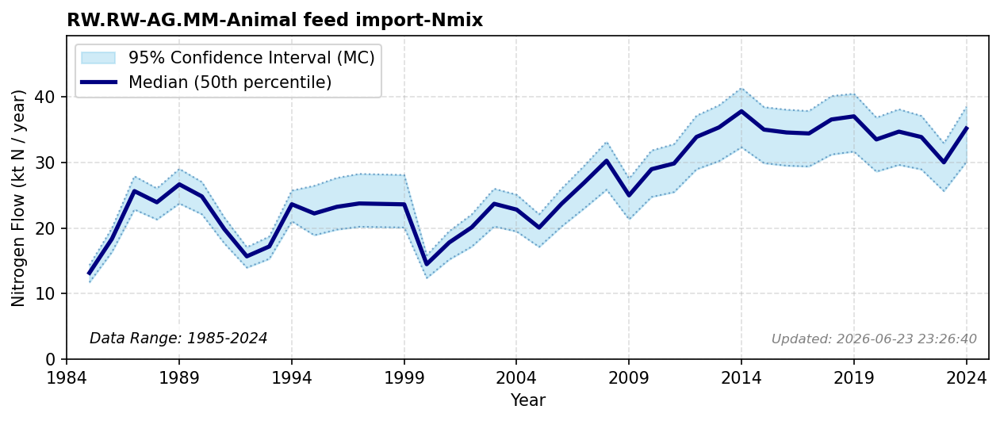

# Animal Feed Import

### Flow Description
Data on imported animal feed is taken from Landbruksdirektoratet and we have used the detailed composition of animal feed together with protein contents from FAO and specific Jones factors to get nitrogen contents. This massive scale of routing vegetable and animal protein through trade loops to sustain livestock production is contextualized globally by \\citet{lassaletta_nitrogen_2016}. Based on the Landbruksdirektoratet data, the N content of the total amount of feed is 0.02 kgN/kg feed. NIBIO Totalkalkylen gives statistics for total amount of feed to Norwegian farm animals between 1959 and 2026, combined with historical domestically produced fraction statistics to determine import dynamics prior to 2000.

### References

* Lassaletta, Luis and Billen, Gilles and Garnier, Josette and Bouwman, Lex and Velazquez, Eduardo and Mueller, Nathaniel D. and Gerber, James S. (2016). *Nitrogen use in the global food system: past trends and future trajectories of agronomic performance, pollution, trade, and dietary demand*. Environmental Research Letters.
