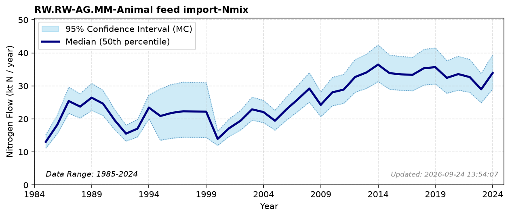

# Animal Feed Import

### Flow Description
Data on imported animal feed is taken from Landbruksdirektoratet and we have used the detailed composition of animal feed together with protein contents from FAO and specific Jones factors to get nitrogen contents.

 N content is applied separately by raw-material type: 0.0197 kgN/kg for carbohydrate raw materials and 0.0648 kgN/kg for protein raw materials. NIBIO Totalkalkylen gives statistics for total amount of feed to Norwegian farm animals between 1959 and 2026. Table 6.10 in (Bruholt & Longva, 1994) gives the domestically produced fraction of farm animal feed between 1985 and 1994. We combine these data to find values before 2000, using an average import fraction for 1995-1999. The 2000-2003 gap between the two source series is bridged with a linear interpolation.

### References

* Bruholt, L. & Longva, S. (1994). *Jordbruksstatistikk 1994*.
