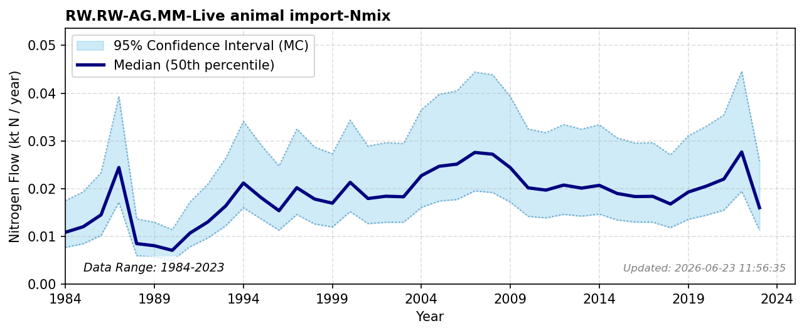

# Live Animal Import

### Flow Description
Is taken from FAOSTAT Crops and livestock products, assuming typical weights of animals from various sources, average 16% protein in whole animal and Jones factor 6.25 for nitrogen to protein (standard). The underlying drivers relating expanding dietary demand and trade to reactive nitrogen impacts are evaluated in [^malik_drivers_2022].

### References


