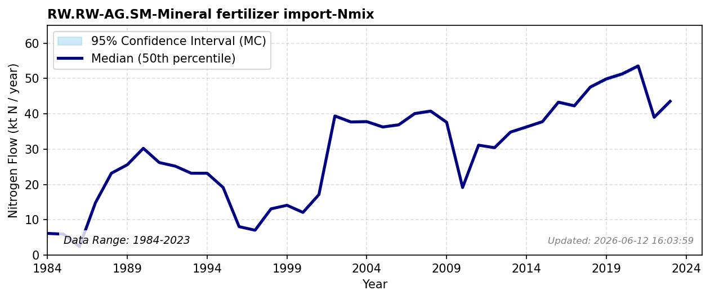

# Mineral Fertilizer Import

### Flow Description
Is taken from FAOSTAT Fertilizer by nutrient. The global influx of synthetic inorganic fertilizers and its dominant role in altering the biospheric cycle on a planetary scale is extensively analyzed by \\citet{smil_nitrogen_1999}. Because anhydrous ammonia is not used directly as fertilizer in Norway, it is not counted as a fertilizer in this particular FAO statistic. We therefore include NH3 import in the flow **RW.RW-MP.OP-Other goods import-Nmix**.

### References


