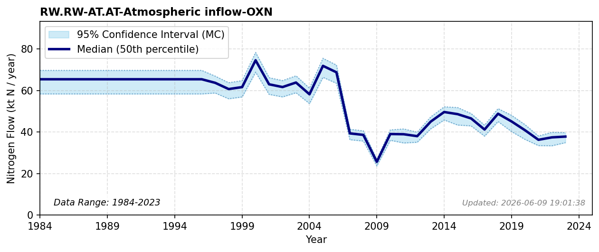

# Atmospheric Inflow (Oxidized N)

### Flow Description
Is found from source-receptor data from EMEP. Global multi-decadal estimates of inorganic nitrogen deposition patterns, including the regional variances and declines over Europe, are thoroughly documented by \\citet{ackerman_global_2019}, while the broader atmospheric chemical transport of combustion emissions is detailed by \\citet{fowler_global_2013}. There is a change in methodology in the EMEP reporting between 2002 and 2003 data.

### References

* Ackerman, Daniel and Millet, Dylan B. and Chen, Xin (2019). *Global {Estimates} of {Inorganic} {Nitrogen} {Deposition} {Across} {Four} {Decades*. Global Biogeochemical Cycles.
* Fowler, David and Coyle, Mhairi and Skiba, Ute and Sutton, Mark A. and Cape, J. Neil and Reis, Stefan and Sheppard, Lucy J. and Jenkins, Alan and Grizzetti, Bruna and Galloway, James N. and Vitousek, Peter and Leach, Allison and Bouwman, Alexander F. and Butterbach-Bahl, Klaus and Dentener, Frank and Stevenson, David and Amann, Marcus and Voss, Maren (2013). *The global nitrogen cycle in the twenty-first century*. Philosophical Transactions of the Royal Society B: Biological Sciences.
