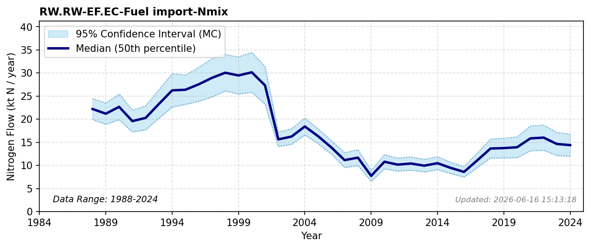

# Fuel Import

### Flow Description
Is taken from trade data, SSB table 08801 for all fuel items except those for transport. The broader perspective of how industrial fuel combustion scales inter-sectoral dependencies and drives global nitrogen footprints is assessed via input-output analysis by Malik (2022).

### References

* Malik, A., Oita, A., Shaw, E., Li, M., Ninpanit, P., Nandel, V., Lan, J., & Lenzen, M. (2022). *Drivers of global nitrogen emissions*. Environmental Research Letters. [https://doi.org/10/gpf2kf](https://doi.org/10/gpf2kf)
