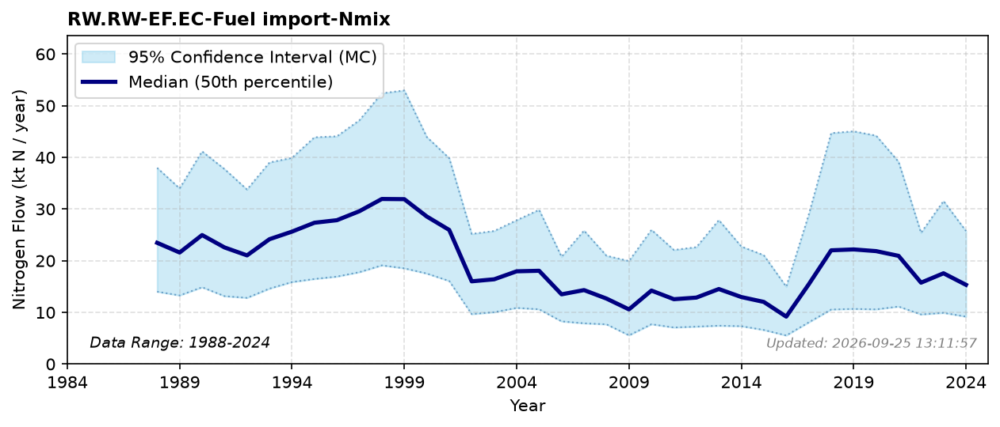

# Fuel Import

### Flow Description
Is taken from trade data, SSB table 08801 for all fuel items except those for transport. Unlike the export side of this flow, coal products (coking coal, bituminous coal, anthracite) dominate here rather than crude oil, since Norway imports comparatively little crude oil but relies on imported coal for coking and industrial use; the total flow is on the order of 12-16 ktN/year (2013-2023).

