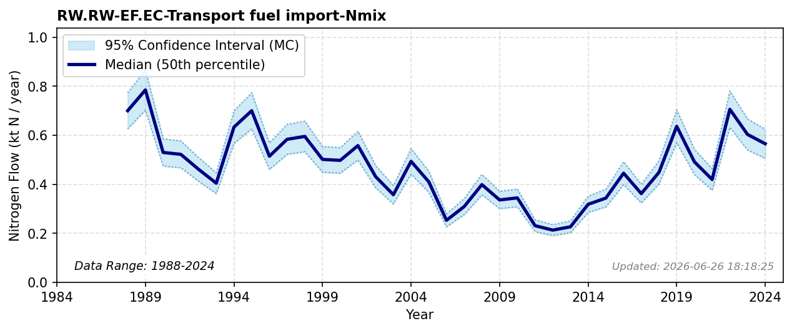

# Transport Fuel Import

### Flow Description
Is taken from trade data, SSB table 08801 for all fuel items for transport. The global nitrogen lifecycle footprint embedded within multi-regional transportation and consumption baskets is investigated by \\citet{malik_drivers_2022}.

### References

* Malik, Arunima and Oita, Azusa and Shaw, Emily and Li, Mengyu and Ninpanit, Panittra and Nandel, Vibhuti and Lan, Jun and Lenzen, Manfred (2022). *Drivers of global nitrogen emissions*. Environmental Research Letters.
