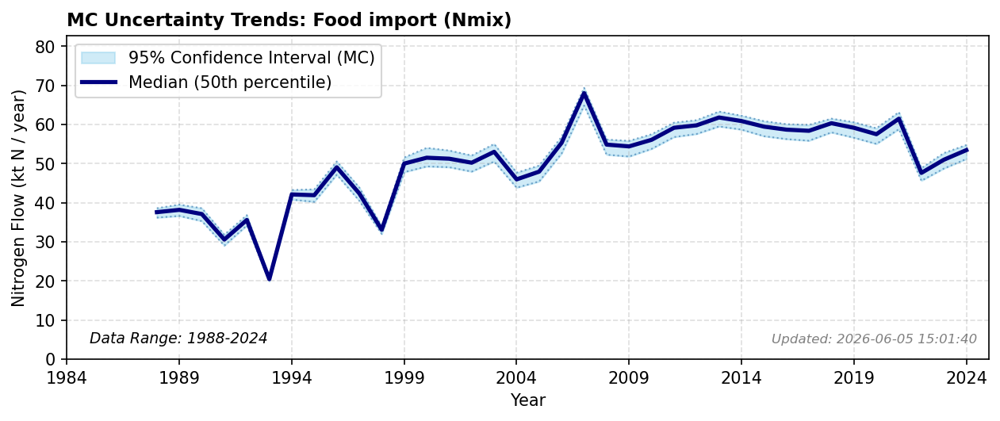

# Food Import

### Flow Description
Is taken from trade data, SSB table 08801. The substantial amount of reactive nitrogen pollution embedded internationally through commodity trade and dietary final demand consumption is heavily supported by \Oita (2016). The HS codes and associated nitrogen contents used are found in the supplementary file.

### References

* Oita, Azusa and Malik, Arunima and Kanemoto, Keiichiro and Geschke, Arne and Nishijima, Shota and Lenzen, Manfred (2016). *Substantial nitrogen pollution embedded in international trade*. Nature Geoscience.
