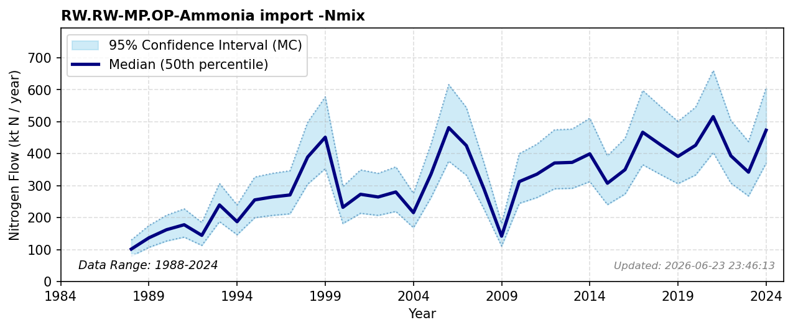

# Ammonia Import

### Flow Description
Is taken from trade data, SSB table 08801. The prospective environmental pressures and potential alterations to the global nitrogen cycle induced by escalating international trade and the emerging ammonia energy sector are critically discussed by Chen (2024) and Bertagni (2023).

### References

* Bertagni, M. B., Socolow, R. H., Martirez, J. M. P., Carter, E. A., Greig, C., Ju, Y., Lieuwen, T., Mueller, M. E., Sundaresan, S., Wang, R., Zondlo, M. A., & Porporato, A. (2023). *Minimizing the impacts of the ammonia economy on the nitrogen cycle and climate*. Proceedings of the National Academy of Sciences. [https://doi.org/10.1073/pnas.2311728120](https://doi.org/10.1073/pnas.2311728120)
* Chen, M., Jiang, S., Han, A., Yang, M., Tkalich, P., & Liu, M. (2024). *Bunkering for change: {Knowledge} preparedness on the environmental aspect of ammonia as a marine fuel*. Science of The Total Environment. [https://doi.org/10.1016/j.scitotenv.2023.167677](https://doi.org/10.1016/j.scitotenv.2023.167677)
