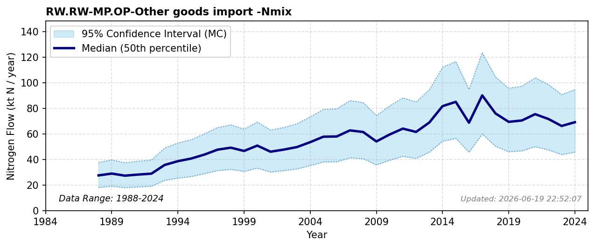

# Other Goods Import

### Flow Description
Is taken from trade data, SSB table 08801. The critical role of non-food manufacturing commodities, such as textiles, clothing, and shelter materials, in driving global marine and freshwater eutrophication footprints via international trade agreements is modeled by Hamilton (2018). Import of N2 is a large contributor but not included here because it does not contribute to the reactive nitrogen cycle.

### References

* Hamilton, Helen A. and Ivanova, Diana and Stadler, Konstantin and Merciai, Stefano and Schmidt, Jannick and van Zelm, Rosalie and Moran, Daniel and Wood, Richard (2018). *Trade and the role of non-food commodities for global eutrophication*. Nature Sustainability. [http://www.nature.com/articles/s41893-018-0079-z](http://www.nature.com/articles/s41893-018-0079-z)
