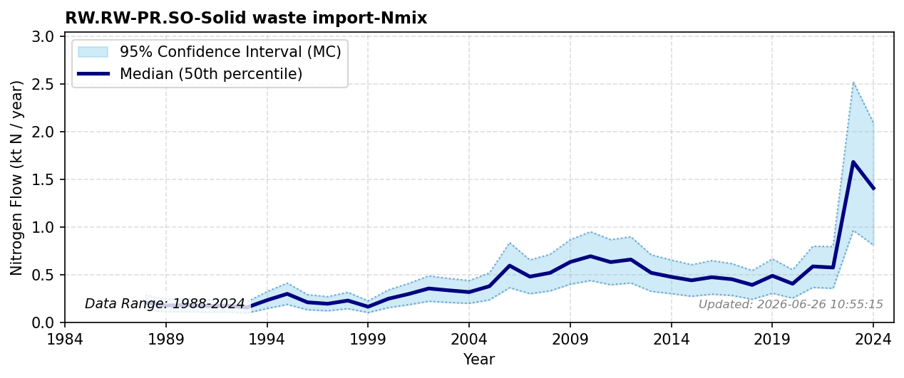

# Solid Waste Import

### Flow Description
Is taken from trade data, SSB table 08801. We include imports of municipal waste, wastewater sludge, hazardous waste, plastic, paper and textile waste. Cross-boundary waste trade footprints and their structural decomposition relative to population and affluence are aligned with Malik (2022) and Hamilton (2018).

### References

* Hamilton, H. A., Ivanova, D., Stadler, K., Merciai, S., Schmidt, J., van Zelm, R., Moran, D., & Wood, R. (2018). *Trade and the role of non-food commodities for global eutrophication*. Nature Sustainability. [https://doi.org/10/gnq4j3](https://doi.org/10/gnq4j3)
* Malik, A., Oita, A., Shaw, E., Li, M., Ninpanit, P., Nandel, V., Lan, J., & Lenzen, M. (2022). *Drivers of global nitrogen emissions*. Environmental Research Letters. [https://doi.org/10/gpf2kf](https://doi.org/10/gpf2kf)
