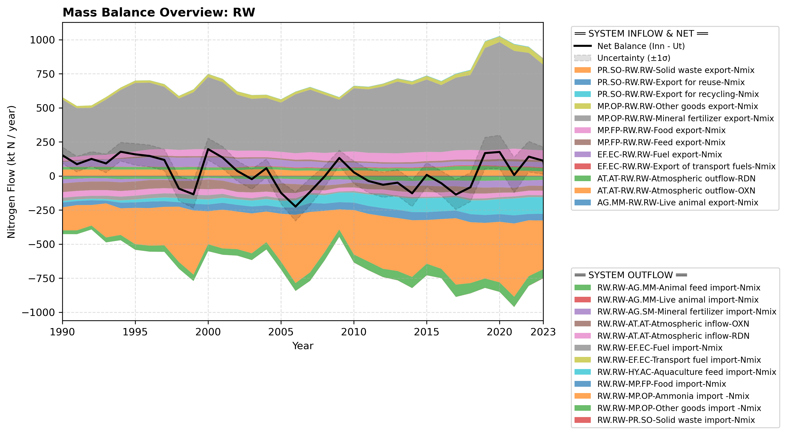

# Pool: Rest of the world (RW)

This section contains all documented nitrogen inflows and transfers originating from the Rest of the world (RW) pool. Click on the individual sub-flows in the left-hand menu to view graphs and methodological explanations.

---

## Mass Balance Overview (1990-2023)

The chart below illustrates the integrated nitrogen mass balance for **RW**. It includes total system inflows (positive stack), total outflows (negative stack), and the net balance line with estimated uncertainty bounds (±1σ).

### Flows that are zero or neglected:

* **RW.RW-MP.FP-Sea fish (landings)-Nmix** is set to zero because all wild fish catch is accounted for under HY.
* **RW.RW-AG.SM-Manure import-Nmix** is assumed small and neglected based on regional boundary assumptions for agricultural surpluses (Schulte-Uebbing, 2022).
* **RW.RW-HY.SW-Import of surface water-Nmix** are assumed negligible due to Norwegian topography.

### References

* Schulte-Uebbing, L. F. and Beusen, A. H. W. and Bouwman, A. F. and de Vries, W. (2022). *From planetary to regional boundaries for agricultural nitrogen pollution*. Nature. [https://www.nature.com/articles/s41586-022-05158-2](https://www.nature.com/articles/s41586-022-05158-2)
